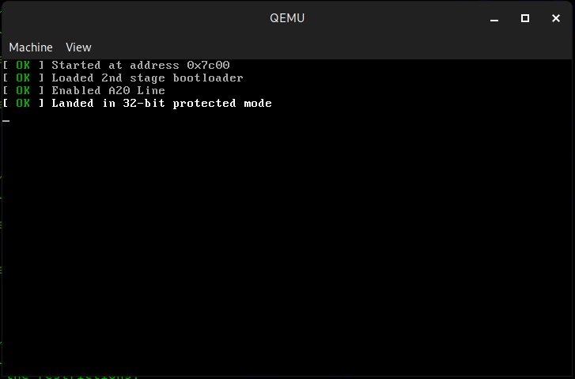

# DiskOS
DiskOS is a simple 32bit [maybe 64bit] operating system created for a school project. Its first purpose was to communicate with ATA hard drives in order to send commands to them but in the future I plan on adding more functionalities to it, like paging, file system support and maybe even a GUI.  
DiskOS is mostly based on Queso Fuego's AmateurOS - https://github.com/queso-fuego/amateuros
## Functionalities
|State|Functionality
:------------ | :-------------
:heavy_check_mark: | Starting in 16bit real mode  
:heavy_check_mark: | Loading more sectors from disk to load the 2'nd stage of the bootloader  
:heavy_check_mark: | A20 Line  
:heavy_check_mark: | 32bit Protected Mode  
:heavy_check_mark: | Printing in pMode using assembly language
:heavy_check_mark: | Loading kernel
:heavy_check_mark: | Automatically setting needed sectors to load by the makefile
:heavy_check_mark: | VESA support
:heavy_check_mark: | Drawing shapes
:heavy_check_mark: | printf implementation
:heavy_check_mark: | Paging
:heavy_check_mark: | Memory manager
:x: | Interrupt handling
:x: | Higher half kernel
:x: | Keyboard driver
:x: | Mouse driver
:x: | FAT32/EXT2 support
:x: | Other file system support
## How to Build and Run
### Requirements
* gcc
* nasm
* qemu
### Building and Running
To build and run DiskOS go into its main folder("DiskOS") and run "make".  
DiskOS will be built and run automatically.
## Screenshots
### Booting process

### Graphics test

